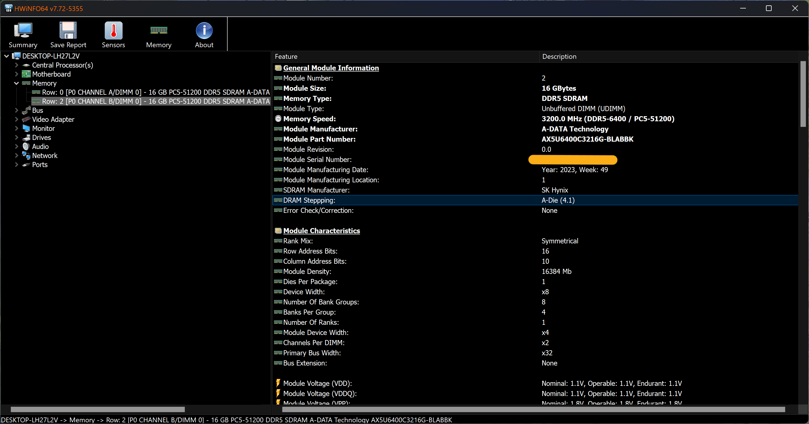
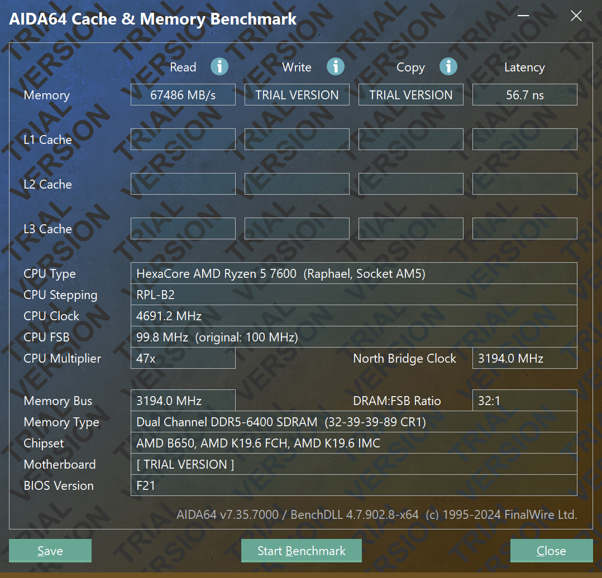

## XPG GLOBAL

<iframe width="100%" height="468" src="https://www.youtube.com/embed/cfH_Q-Vj2ZU?si=YdROLBVEeSAVxwox" title="YouTube video player" frameborder="0" allow="accelerometer; autoplay; clipboard-write; encrypted-media; gyroscope; picture-in-picture; web-share" referrerpolicy="strict-origin-when-cross-origin" allowfullscreen></iframe>

## INFO

:::note
SK Hynix A-Die.
:::

## Testing

| Component     | 		Selection                                                                                                                                                                                                 |
|---------------|-------------------------------------------------------------------------------------------------------------------------------------------------------------------------------------------------------------|
| `CPU`       | Ryzen 5 7600                                                                                                                                                                                      |
| `MB`   | B650I AORUS ULTRA                                                                                                                                                                            |
| `Memory` | AX5U6400C3216G-DTLABBK                                                                                                                                                   |
| `OS`       | Windows 11 Pro |

## Performance

Set up EXPO 6400MT/s CL32-39-39-89 in BIOS. In Advanced Memory Settings, disable Power Down Enable, Gear Down Mode and Memory Context Restore. With UCLK = MEMCLK and 2133 MHz FCLK setting, got latency 56.7 ns.