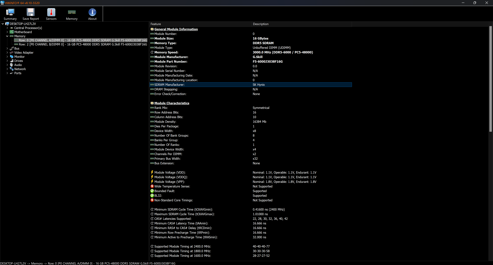
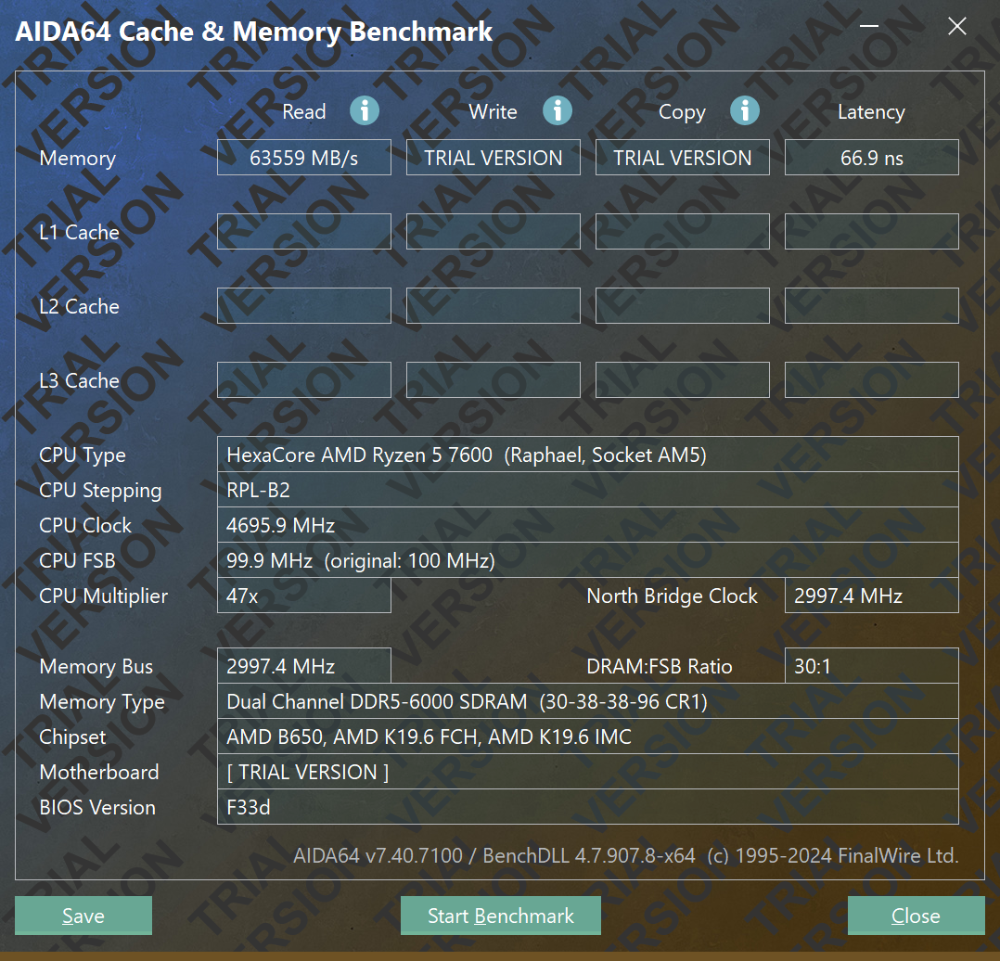

## G.SKILL Official

<iframe width="100%" height="468" src="https://www.youtube.com/embed/3A4cx-PqdSw?si=GN-L59NMMRDhQD1x" title="YouTube video player" frameborder="0" allow="accelerometer; autoplay; clipboard-write; encrypted-media; gyroscope; picture-in-picture; web-share" referrerpolicy="strict-origin-when-cross-origin" allowfullscreen></iframe>

## INFO

:::note
SK Hynix IC
:::

## Testing

| Component     | 		Selection                                                                                                                                                                                                 |
|---------------|-------------------------------------------------------------------------------------------------------------------------------------------------------------------------------------------------------------|
| `CPU`       | Ryzen 5 7600                                                                                                                                                                                      |
| `MB`   | B650I AORUS ULTRA                                                                                                                                                                            |
| `Memory` | F5-6000J3038F16GX2-TZ5NR                                                                                                                                                   |
| `OS`       | Windows 11 Pro |

## Performance

Set up EXPO 6000MT/s CL30-38-38-96 in BIOS. In Advanced Memory Settings, disable Power Down Enable and Memory Context Restore. With UCLK = MEMCLK and 2000 MHz FCLK setting, got latency 66.9 ns.