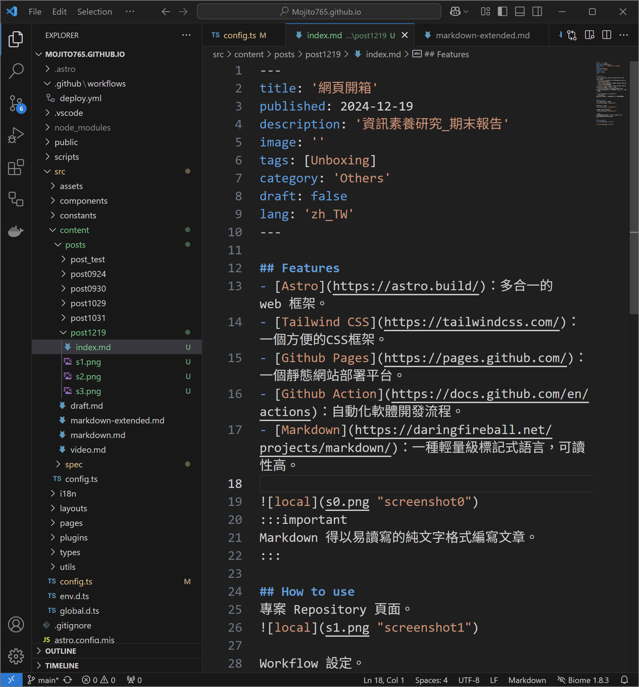
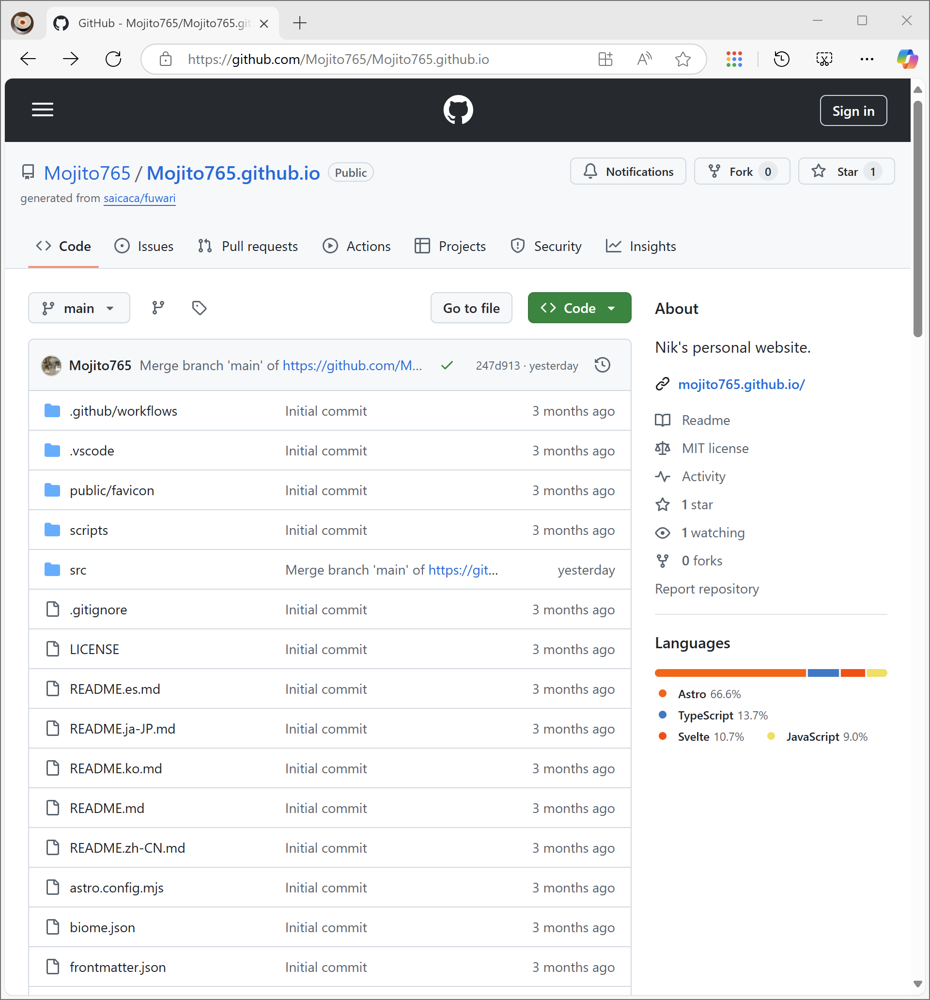
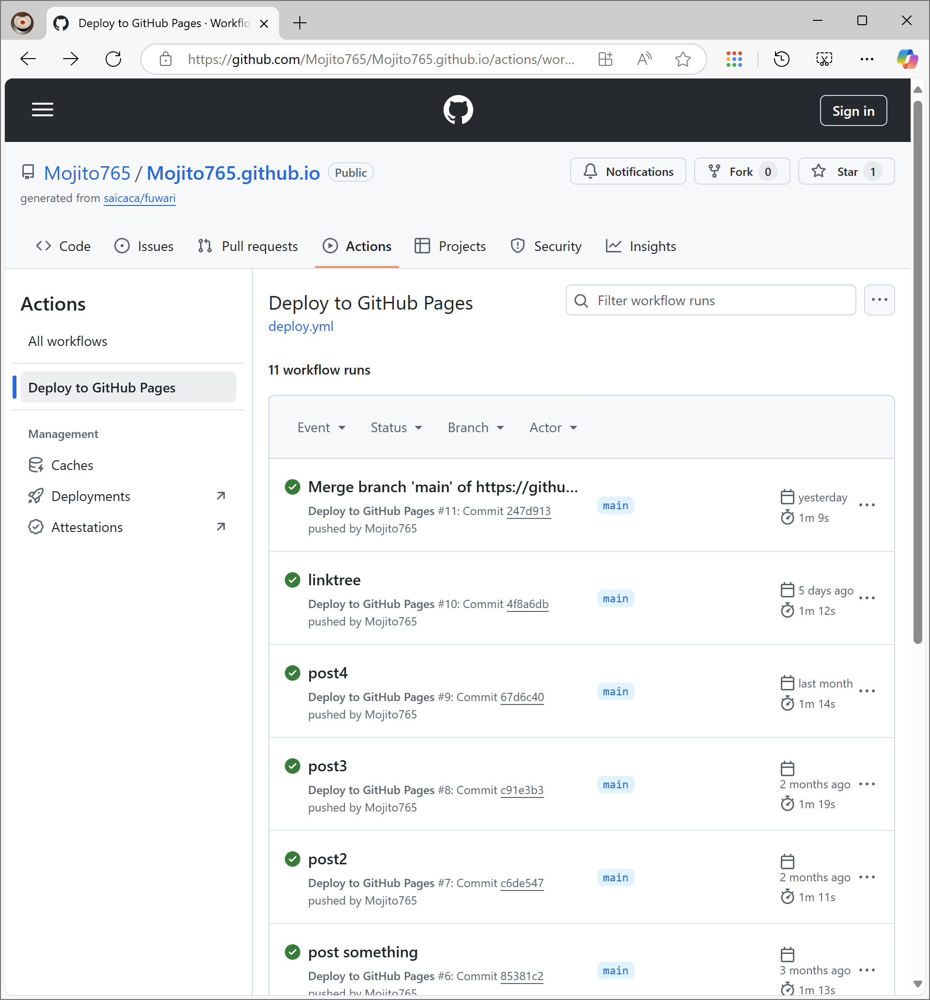

## Features
- [Astro](https://astro.build/)：多合一的 web 框架。
- [Tailwind CSS](https://tailwindcss.com/)：一個方便的CSS框架。
- [Github Pages](https://pages.github.com/)：一個靜態網站部署平台。
- [Github Action](https://docs.github.com/en/actions)：自動化軟體開發流程。
- [Markdown](https://daringfireball.net/projects/markdown/)：一種輕量級標記式語言，可讀性高。

:::important
Markdown 得以易讀寫的純文字格式編寫文章。
:::


## Intro

> 專案 Repository 頁面。

```markdown
name: Deploy to GitHub Pages

on:
  # Trigger the workflow every time you push to the `main` branch
  # Using a different branch name? Replace `main` with your branch’s name
  push:
    branches: [ main ]
  # Allows you to run this workflow manually from the Actions tab on GitHub.
  workflow_dispatch:

# Allow this job to clone the repo and create a page deployment
permissions:
  contents: read
  pages: write
  id-token: write

jobs:
  build:
    runs-on: ubuntu-latest
    steps:
      - name: Checkout your repository using git
        uses: actions/checkout@v4
      - name: Install, build, and upload your site
        uses: withastro/action@v3
# with:
# path: . # The root location of your Astro project inside the repository. (optional)
# node-version: 20 # The specific version of Node that should be used to build your site. Defaults to 20. (optional)
# package-manager: pnpm@latest # The Node package manager that should be used to install dependencies and build your site. Automatically detected based on your lockfile. (optional)

  deploy:
    needs: build
    runs-on: ubuntu-latest
    environment:
      name: github-pages
      url: ${{ steps.deployment.outputs.page_url }}
    steps:
      - name: Deploy to GitHub Pages
        id: deployment
        uses: actions/deploy-pages@v4
```
> Workflow 設定。


> 部署到 Github Pages。

:::note
網域名稱：指定為**_username.github.io_**。
:::

