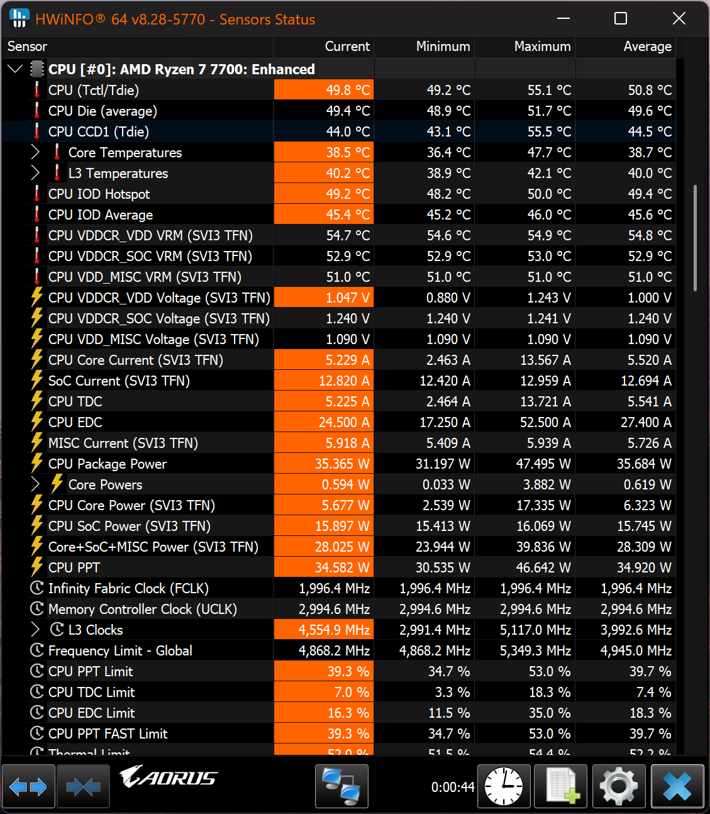

## Test Setup

| Component     | 		Selection                                                                                                                                                                                                 |
|---------------|-------------------------------------------------------------------------------------------------------------------------------------------------------------------------------------------------------------|
| `CPU`       | Ryzen 7 7700                                                                                                                                                                                      |
| `MB`   | B650I AORUS ULTRA                                                                                                                                                                            |
| `Memory` | F5-6000J3038F16GX2-TZ5NR                                                                                                                                                   |
| `CPU Cooler`       | Noctua D12L |

:::note
Integrated Graphics disabled
:::

## Screenshot

> CPU Package Power 35.365 W